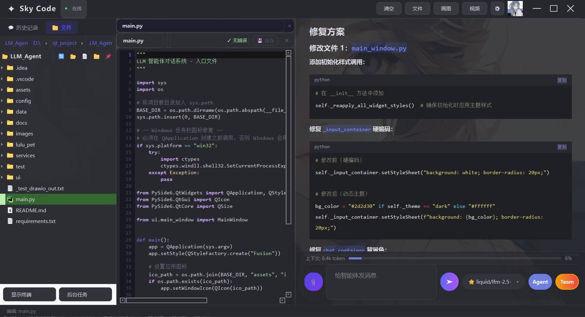

# Sky Code - AI 智能助手桌面应用

基于 PySide6 和 LangChain 框架构建的多功能 AI 桌面助手，支持大语言模型对话、智能体推理、文档解析和数据分析，支持自定义接入模型，可选Chat/Agent模式。
## UI展示


[//]: # (![img_1.png]&#40;images/img_1.png&#41;)

[//]: # (![img.png]&#40;images/img_2.png&#41;)
## 功能特性

### 智能对话
- 支持多种大语言模型（OpenAI 兼容 API）
- 流式输出，实时显示生成内容
- Markdown 渲染，代码高亮与一键复制
- 上下文记忆管理，支持自动摘要压缩
- 自定义模型接入，灵活配置 API 地址和密钥

### 智能体模式
- ReAct 推理循环，自主规划与执行工具调用
- 多步推理，支持复杂任务分解
- 思考过程可视化，工具调用状态实时显示
- 多智能体编排，支持子智能体协作与任务分发
- 后台 Agent，支持异步长任务执行与状态查询

### 工具系统

| 类别 | 工具 |
|------|------|
| 文件操作 | 读取、写入、编辑、删除、目录浏览、项目扫描、文件搜索、命令执行、代码执行 |
| 网络访问 | HTTP 请求、网页抓取、API 调用、文件下载、网络搜索 |
| 数据分析 | CSV/Excel 读取、数据统计、图表生成、数据转换 |
| 文档解析 | PDF、Word、PPT 内容提取与元数据读取 |
| 工作流编排 | 顺序执行、并行执行、条件分支、循环迭代 |
| 代码检索（RAG） | 代码语义搜索、索引状态、自动索引预热 |
| 语言服务（LSP） | 诊断、跳转定义、悬停信息、查找引用、文档符号、格式化 |
| 代码审查 | 代码审查、Bug 查找、安全扫描、代码异味检测、指标统计 |
| 调试器 | 脚本调试、断点、调用栈、Trace 执行 |
| 终端输出 | 终端输出读取、命令历史、终端清理 |
| 后台 Agent | 后台任务启动、状态查询、任务列表、取消任务 |
| Web 预览 | 预览服务器启停、预览列表、浏览器中预览 |

### 界面特性
- 现代化 UI 设计，支持亮色/暗色主题
- 自定义背景图片，毛玻璃透明效果
- 左侧历史对话管理，支持搜索与排序
- 内置文件浏览器，支持双击打开文件
- 内嵌终端面板，支持命令执行
- 图片生成面板，支持文生图与图生图
- 视频生成面板
- 模型参数实时调节（温度、Token 数、推理步数）

## 快速开始

### 环境要求

- Python 3.9+
- Windows 10/11

### 安装依赖

```bash
pip install -r requirements.txt
```

### 启动应用

```bash
python main.py
```

## 项目结构

```
LLM_Agent/
├── main.py                 # 应用入口
├── config/                 # 配置（模型、背景等）
├── services/
│   ├── core/               # 核心服务
│   │   ├── api_service.py      # API 调用与工具 Schema 构建
│   │   ├── chat_service.py     # 对话管理服务
│   │   ├── agent_service.py    # 智能体（ReAct）服务
│   │   ├── memory_service.py   # 记忆管理服务
│   │   ├── storage_service.py  # 数据持久化服务
│   │   ├── custom_model_service.py # 自定义模型服务
│   │   └── background_agent.py # 后台 Agent
│   ├── providers/          # 模型/服务商适配（OpenAI 兼容、DeepSeek、Kimi、MiniMax、ChatGPT 等）
│   ├── multi_agent/        # 多智能体编排（orchestrator、sub_agent、registry）
│   ├── tools/              # 工具集（文件/网络/数据/文档/工作流/RAG/LSP/审查/调试/终端/后台/预览）
│   ├── image_service.py    # 图片生成服务
│   └── video_service.py    # 视频生成服务
├── ui/
│   ├── main_window.py      # 主窗口
│   ├── widgets.py          # 自定义组件
│   ├── settings_dialog.py  # 设置对话框
│   ├── markdown_renderer.py # Markdown 渲染
│   └── styles.py           # 样式定义
├── assets/                 # 资源文件
└── data/                   # 会话与缓存数据
```

## 配置说明

### 模型配置

在 `config/custom_models.json` 中配置模型：

```json
{
  "default_model": "mimo-v2.5-pro",
  "models": {
    "provider/model-id": {
      "name": "模型名称",
      "provider": "提供商",
      "model_id": "模型ID",
      "base_url": "API地址",
      "api_key": "API密钥",
      "description": "描述",
      "model_type": "text"
    }
  }
}
```

### 背景配置

在 `config/background_config.json` 中配置背景：

```json
{
  "image_path": "图片路径",
  "opacity": 0.3
}
```

## 使用说明

1. **发送消息**：在底部输入框输入内容，按 Enter 或点击发送按钮
2. **切换模型**：在顶部导航栏下拉框中选择模型
3. **智能体模式**：点击顶部 "Agent 模式" 按钮开启
4. **历史对话**：点击左侧会话列表切换对话
5. **文件浏览**：点击顶部文件按钮展开文件浏览器
6. **图片生成**：点击画图按钮打开图片生成面板
7. **设置**：点击设置按钮调节参数、更换背景、管理自定义模型

## 技术栈

- **UI 框架**：PySide6 (Qt for Python)
- **AI 框架**：LangChain
- **数据处理**：Pandas, Matplotlib
- **文档解析**：PyPDF2, python-docx, python-pptx
- **数据存储**：SQLite
- **网络请求**：requests
- **模型适配**：OpenAI 兼容 API、DeepSeek、Kimi、MiniMax、ChatGPT 等
- **多智能体**：自研编排框架（Orchestrator + Sub-Agent）

## 许可证

MIT License
